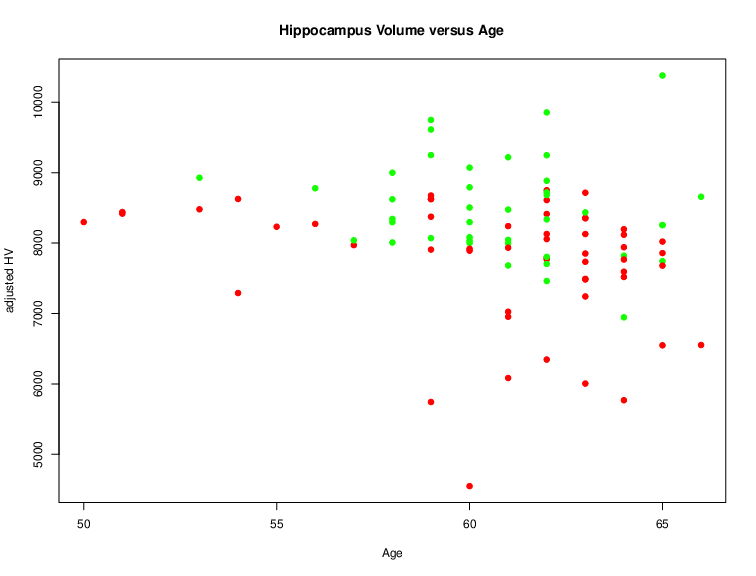

# Neurodegeneration Assessment from MRI

## Uso

El calculo de N se hace mediante el script *nplus.r*, que depende de las bibliotecas,

  - e1071
  - caret
  - caTools
  - ADNIMERGE

Basicamente construye un Prior bayesiano tomando los sujetos del baseline de ADNIMERGE diagnosticados como *Dementia* y *CN* y asumiendo que *Dementia* => N+ y *CN* => N-. Debe entonces construirse un archivo CSV con los datos de segmentacion y parcelacion de FS y añadirse la variable *AGE* con la edad de los sujetos. 

Eemplo, para el caso del proyecto *bioface19*, primero construimos un archivo con los datos de FS.

```
xnat_pullfs.pl -s aseg -x bioface19 -o bf_base_aseg.csv
xnat_pullfs.pl -s aparc -x bioface19 -o bf_base_aparc.csv
join -t, bf_base_aseg.csv bf_base_aparc.csv > bf_base.csv
```

Ahora construimos un archivo con las edades correspondientes,

```
$ head bf_age.csv 
Subject_ID,AGE
B001,64
B002,53
B003,60
B004,64
B005,62
B006,64
B007,62
B008,58
B009,51
```

y los unimos al anterior,

```
join -t, bf_base.csv bf_age.csv > input_data.csv
```

Finalmente ejecutamos el script,

```
Rscript nplus.r
```

y obtenemos los resultados en el archivo *classifier_output.csv*,

```
$ head classifier_output.csv 
"Subject_ID","ND"
"B001","0"
"B002","1"
"B003","0"
"B004","1"
"B005","1"
"B006","1"
"B007","0"
"B008","0"
"B009","1"
```
 y un grafico de control en *classifier_output.png*,



## Como citarlo

El metodo completo esta escrito en ingles y disponible formato MS Office en el archivo *nplus_method.docx*.

## Mas info

Toda la informacion relativa a la construccion del metodo, a pruebas varias con otros metodos y a posibles extensiones esta disponible en,

https://detritus.fundacioace.com/wiki/doku.php?id=neuroimagen:bioface_atn

